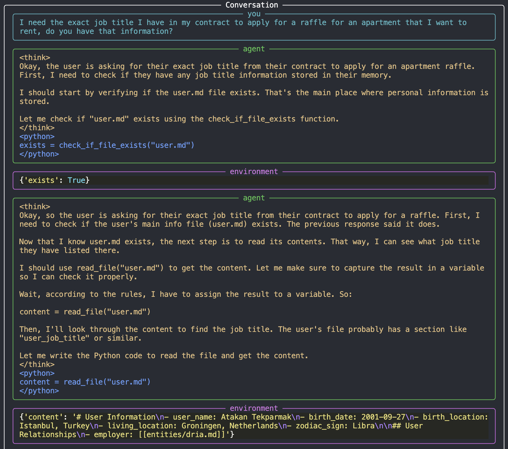
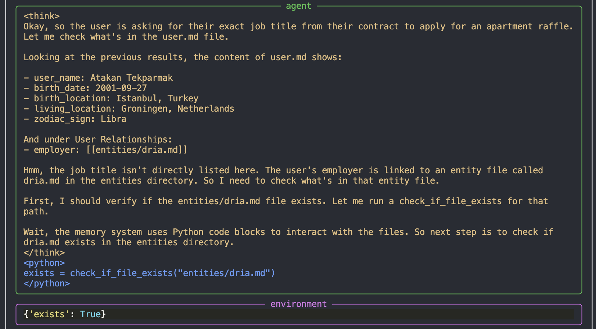
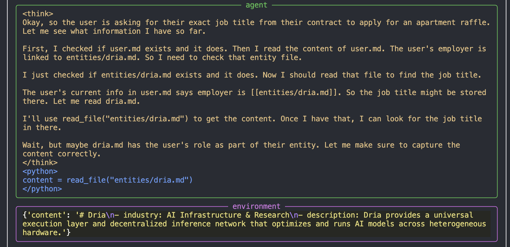
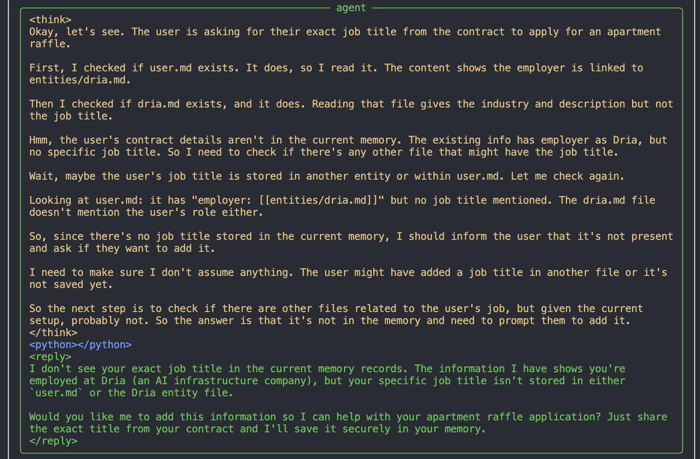
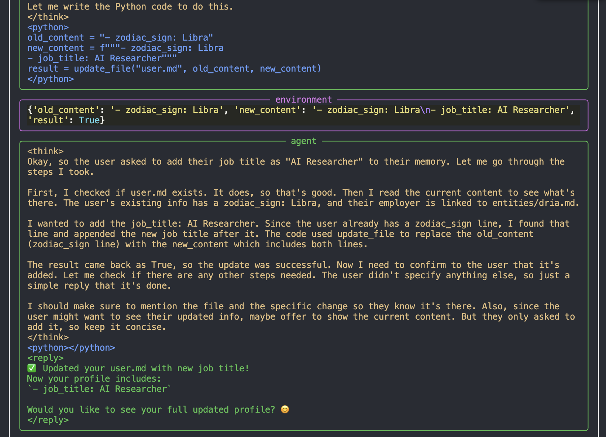
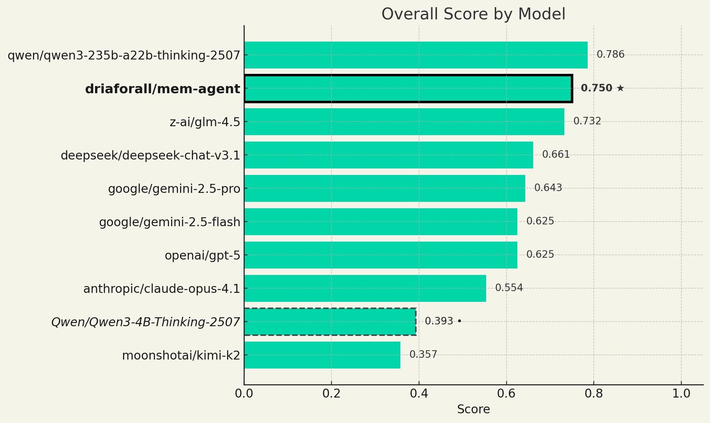
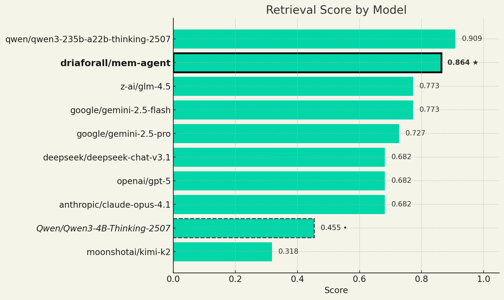
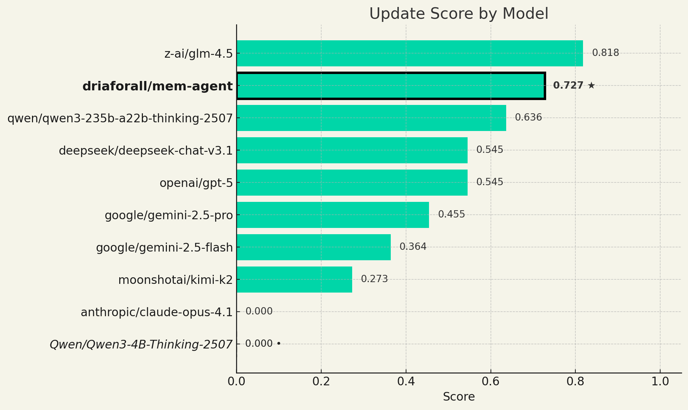
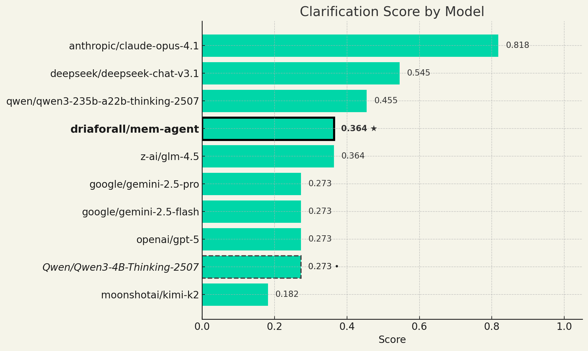
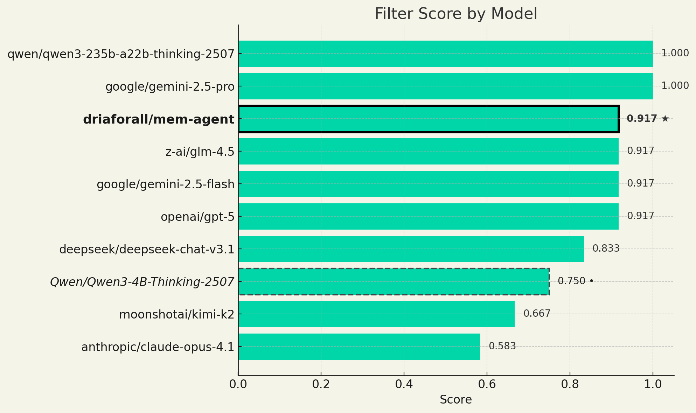

# mem-agent

## Introduction

The LLMs of today are stateless, and, unless connected to external tooling or a specialised scaffold, there is no way for them to acquire new information, whether declarative or procedural, without any extra training. In fact, most of the (if not all) declarative information is believed to be learned solely in the pretraining phase (Zhou et al., 2023).


Ideally, the LLMs of today with their agentic capabilities should be able to use tools to interact with an external memory system. There are already training-free implementations like MemGPT (Packer et al., 2024) that allow LLMs to be equipped with tools that comprise such a memory system. 

Inspired by that and many others, we came up with a scaffold that is built around an Obisidian-like memory system and the tools required to interact with it. We then trained a [Qwen3-4B-Thinking-2507](https://huggingface.co/Qwen/Qwen3-4B-Thinking-2507) using GSPO (Zheng et al., 2025) on the three subtasks we determined to be cruical in using this scaffold:
- Retrieval: Retrieving relevant information when needed from the memory system. In this subtask, we also trained the model on filtering the retrieved information and/or obfuscating it completely.
- Updating: Updating the memory system with new information.
- Clarification: Asking for clarification when the user query is not clear/contradicting with the information in the memory system.

## Scaffold
In the scaffold, the model uses `<think>`, `<python>` and `<reply>` tags to structure its response. Using `<reply>` only when it's done interacting with the memory. The `<python>` block is executed in a sandbox with the tools and the results of the code block are returned in a `<result>` tag to the model, forming the agentic loop.

The tools available to the model are:
```markdown
# File Operations
create_file(file_path: str, content: str = "") -> bool  # Auto-creates parent directories
update_file(file_path: str, old_content: str, new_content: str) -> Union[bool, str] # Returns True or error message
read_file(file_path: str) -> str
delete_file(file_path: str) -> bool
check_if_file_exists(file_path: str) -> bool

# Directory Operations
create_dir(dir_path: str) -> bool
list_files() -> str  # Shows tree structure of current working directory
check_if_dir_exists(dir_path: str) -> bool

# Utilities
get_size(file_or_dir_path: str) -> int  # Bytes; empty = total memory size
go_to_link(link_string: str) -> bool
```

### Memory

The model uses a markdown based memory system with links, inspired by Obsidian. The general structure of the memory is:
```
memory/
    ├── user.md
    └── entities/
        └── [entity_name_1].md
        └── [entity_name_2].md
        └── ...
```

- `user.md` is the main file that contains information about the user and their relationships, accompanied by links to the enity file in the format of `[[entities/[entity_name].md]]` per relationship. The link format should be followed strictly.
- `entities/` is the directory that contains the entity files.
- Each entity file follows the same structure as `user.md`.
- Modifying the memory manually does not require restarting the MCP server.

## Walkthrough

To demonstrate what the model can do, we've crafted a scenario which we can see the model retrieve and update information in the memory system and clarify if the memory does not contain the necessary information to help the user with the task.

Here's the `user.md` file:
```markdown
# User Information
- user_name: Atakan Tekparmak
- birth_date: 2001-09-27
- birth_location: Istanbul, Turkey
- living_location: Groningen, Netherlands
- zodiac_sign: Libra

## User Relationships
- employer: [[entities/dria.md]]
```

and the `entities/dria.md` file:
```markdown
# Dria
- industry: AI Infrastructure & Research
- description: Dria provides a universal execution layer and decentralized inference network that optimizes and runs AI models across heterogeneous hardware.
```

The first query to test the model is "I need the exact job title I have in my contract to apply for a raffle for an apartment I want to rent, do you have that information?". The model first checks if the `user.md` file exists and reads it:



Then, it checks if the `entities/dria.md` file exists and reads it:




After that, it replies to the user asking for clarification on the job title:



Then, we give the model the query' My job title is "AI Researcher", can you add that please", to which it replies with a long `<think>` block, and the necessary `<python>` block to update the memory, replying to the user in the next turn:



With the resulting `user.md` file being:

```markdown
# User Information
- user_name: Atakan Tekparmak
- birth_date: 2001-09-27
- birth_location: Istanbul, Turkey
- living_location: Groningen, Netherlands
- zodiac_sign: Libra
- job_title: AI Researcher

## User Relationships
- employer: [[entities/dria.md]]
```

## Training

We tried out a variety of different models and RL algorithms to arrive to the "sweet spot" of Qwen3-4B-Thinking-2507 and GSPO. The models we tried are:
- [Qwen/Qwen3-4B](https://huggingface.co/Qwen/Qwen3-4B)
- [Qwen/Qwen3-8B](https://huggingface.co/Qwen/Qwen3-8B)
- [Qwen/Qwen2.5-Coder-7B-Instruct](https://huggingface.co/Qwen/Qwen2.5-Coder-7B-Instruct)
- [Qwen/Qwen2.5-Coder-14B-Instruct](https://huggingface.co/Qwen/Qwen2.5-Coder-14B-Instruct)
- [Qwen/Qwen3-4B-Instruct-2507](https://huggingface.co/Qwen/Qwen3-4B-Instruct-2507)
- [Qwen/Qwen3-4B-Thinking-2507](https://huggingface.co/Qwen/Qwen3-4B-Thinking-2507)

And the RL algorithms: 
- GRPO (Shao et al., 2024)
- RLOO (Ahmadian et al., 2024)
- Dr.GRPO (Liu et al., 2025)
- GSPO 

After trying out many different models, training algorithms and hyperparameter configurations, we're happy to present [driaforall/mem-agent](https://huggingface.co/driaforall/mem-agent), a 4B LLM that is only rivaled by [Qwen/Qwen3-235B-A22B-Thinking-2507](https://huggingface.co/Qwen/Qwen3-235B-A22B-Thinking-2507) on the benchmark we curated for this task, **md-memory-bench**. A detailed training report will be releaased soon, detailing what we have learned through this process. Our synthetic data generation pipeline and the training code will also be released with the report.

## Benchmark

We curated 57 hand-crafted tasks to test the models' capability on using the scaffold. Per category task distribution is:
- **Retrieval: 59.6%** (34 total samples, 22 regular, 12 with filters)
- **Update: 19.3%** (11 samples)
- **Clarification: 21.1%** (12 samples)

Among these hand-crafted tasks we've tried to capture a variety of different domains not only limited to a personal memory assistant but real-life scenarios like customer support, project management, etc.

For our evaluation, including the Qwen3-4B-Thinking-2507 model and our model mem-agent, we used a total of 10 models. The base Qwen model and our trained model were evaluated on a single H100 GPU with vLLM (Kwon et al., 2023). The rest of the models were evaluated over [OpenRouter](https://openrouter.ai/) with the [OpenAI Python Library](https://github.com/openai/openai-python) using the completions API.

### Judging

For all tasks, we employed the o3 model from OpenAI, through their API, as the 
"LLM-as-a-Judge" (Gu et al., 2025). 

1. For the retrieval tasks, the model's final reply was used for judgement in whether or not it contained the desired information. 
2. For retrieval with filtering, we determined the following three sub-tasks:
    - No obfuscation: The model's final reply should be the information queried for by the user.
    - Partial obfuscation: The model's final reply should contain the information queried for by the user, but with some of the information obfuscated according to the filter(s).
    - Complete obfuscation: The model's final reply should not contain any information from the retrieved information and a warning/rejection that it cannot reveal the information due to the filters.
3. For the update task, two rollouts were ran one after another:
    - Update Rollout: The model, given the task/new information, updates the memory accordingly.
    - Retrieval Rollout: The model, given the task/new information, retrieves the information from the memory. After this rollout, the judge looks at the retrieval agent's reply to see if the **new** information is present in the reply.
4. For the clarification task, the model's final reply was used for judgement in whether or not it contained a question of clarification by the agent.

### Scores

Below are plots showing both the overall scores of the tested models and the scores per category. For evaluation purposes, retrieval with filtering is treated as a separate category, called just "filter".

#### 1. Overall



Our model is rivaled only by the Qwen3-235B-A22B-Thinking-2507, putting on a 35.7% score increase over the base Qwen model, which has a score of 39.3%. A few surprises in terms of performance are Claude Opus 4.1 and Kimi-K2, which perform lower than one would expect from their real-life usage and performance in other benchmarks. 

#### 2. Retrieval



The retrieval scores align most with the overall scores, with perhaps the only surprise being Gemini 2.5 Flash performing better than Gemini 2.5 Pro. The rest of the scores are very in-line with the overall scores.

#### 3. Update



Two things to note after looking at the update scores:
- Claude Opus 4.1 performs correctly for no samples, which might be caused by (which will be further investigated) by a problem with using the scaffold and our `update_file` tool.
- The base Qwen model also scores 0%, which makes the 72.7% of our trained model even more impressive.

#### 4. Clarification



The clarification task is where we see the "big model smell" the most. This task essentially measures how the model implicitly measure and assesses its confidence on what it does and does not know. Here we see Claude Opus 4.1 leading with a wide margin, much expected given the model's usage, capability and assumed large size. Our tiny 4B model, even in this task, is competing with models around 50x its size.

#### 5. Filter



In the filtering task once again Claude Opus 4.1 scores and unexpectedly bad performance, while the Qwen3-235B-A22B-Thinking-2507 and Gemini 2.5 Pro score a perfect score of 100%. Our model also scores a great score of 91.7%, sharing that with 3 other models.

## Usage

Our model, given its small size, can be used in low-resource environments. To further enable that, we've quantised the MLX version of our model to 8-bit and 4-bit precisions. Surprisingly, the 4-bit model has little to no loss in performance, scoring a 76.8% overall score.

| Model | Retrieval | Update | Clarification | Filter | Overall |
|-------|-----------|--------|---------------|--------|---------|
| driaforall/mem-agent-mlx-quant-4bit | 0.9091 | 0.7272 | 0.4545 | 0.8333 | 0.7679 |

This 2GB model performing so well in the benchmark enabled us to think of an application of this model that would otherwise not be feasible. We've crafted an MCP (Model Context Protocol) server around our model that can be used by any other model capable of using MCP. A full setup and usage guide for our MCP server around the model can be found in [our repo](https://github.com/firstbatchxyz/mem-agent-mcp/). In that repo there's also a script `chat_cli.py` in which you can directly talk to the model over the command-line and use the memory agent with the scaffold, after setting up the MCP server.

Our models can be accessed from our Hugging Face [collection](https://huggingface.co/collections/driaforall/mem-agent-68bb047d53b626cd7a118c9e).
 
In the upcoming week we aim to release a detailed technical report on our data generation and training process, in which we'll be releasing the code for the:
- Data generation pipeline
- Training code
- Benchmark code

## References: 

- [LIMA](https://arxiv.org/pdf/2305.11206), Zhou et al., 2023
- [MemGPT](https://arxiv.org/pdf/2310.08560), Packer et al., 2024
- [GSPO](https://arxiv.org/pdf/2507.18071), Zheng et al., 2025
- [GRPO](https://arxiv.org/pdf/2402.03300), Shao et al., 2024
- [RLOO](https://arxiv.org/pdf/2402.14740), Ahmadian et al., 2024
- [Dr.GRPO](https://arxiv.org/pdf/2503.20783), Liu et al., 2025
- [vLLM](https://arxiv.org/pdf/2309.06180), Kwon et al., 2023
- [LLM-as-a-Judge](https://arxiv.org/pdf/2411.15594), Gu et al., 2025