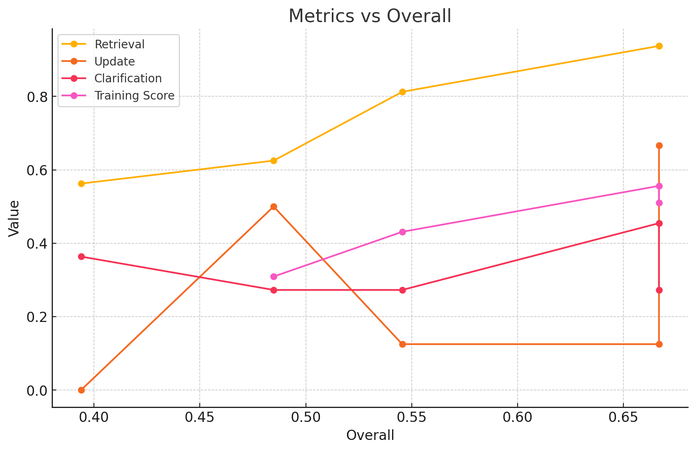
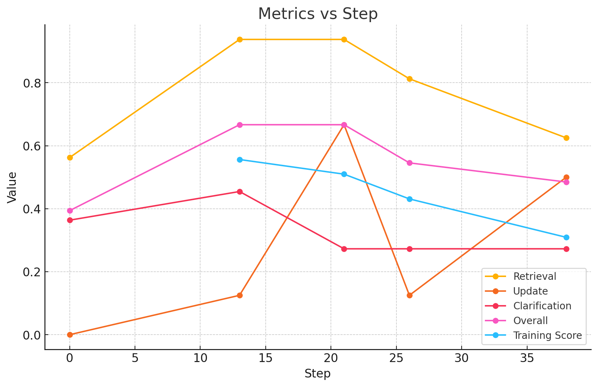
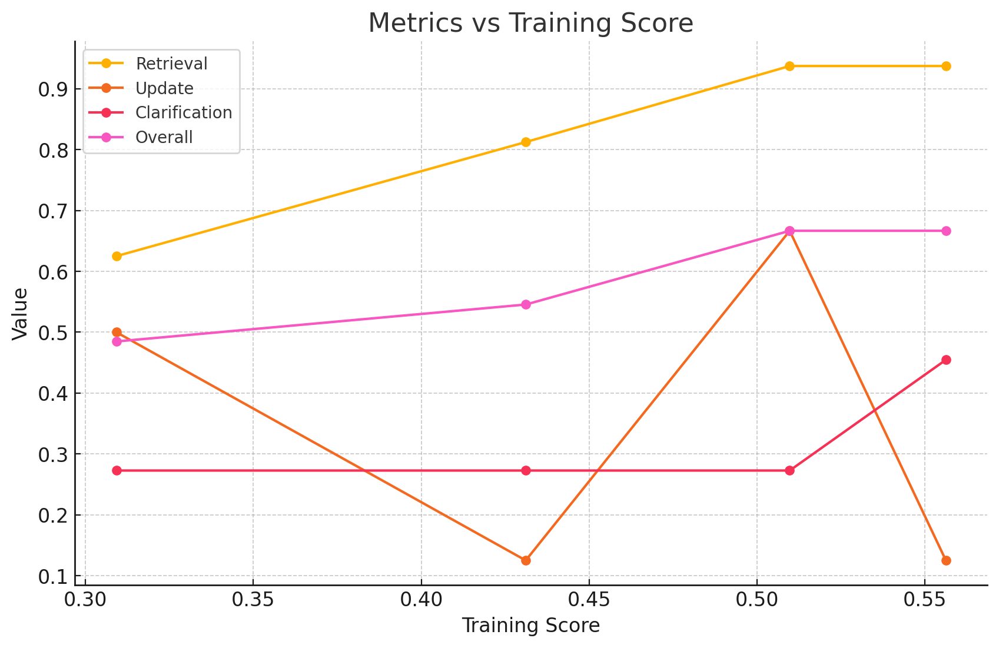
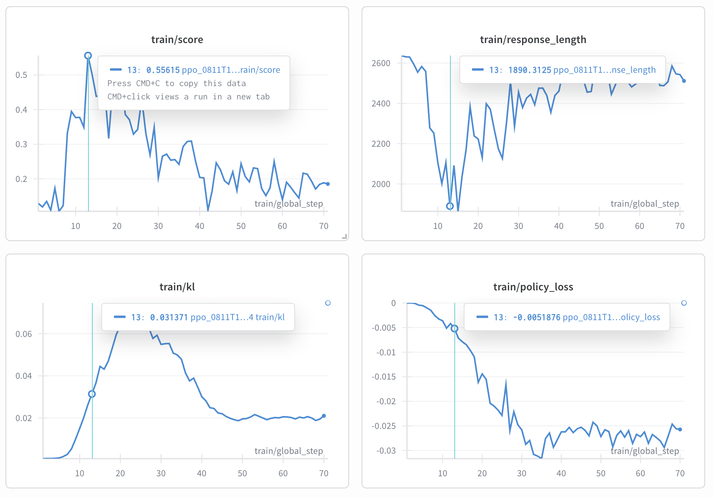
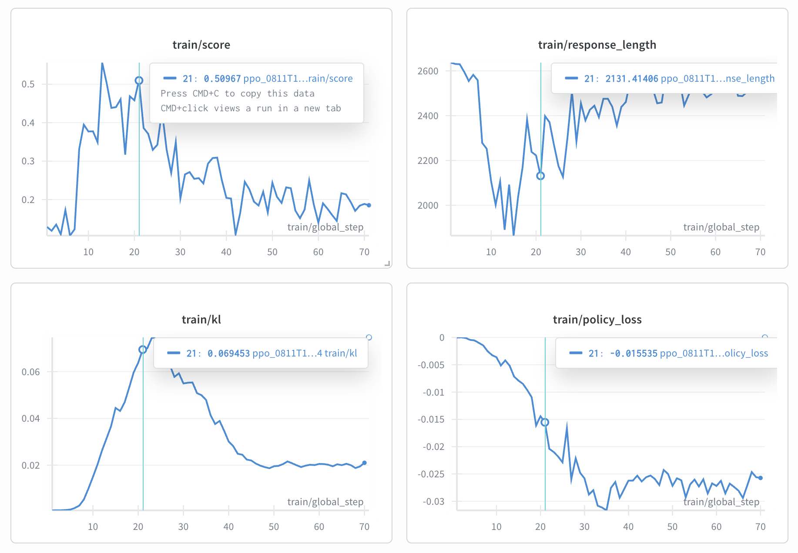
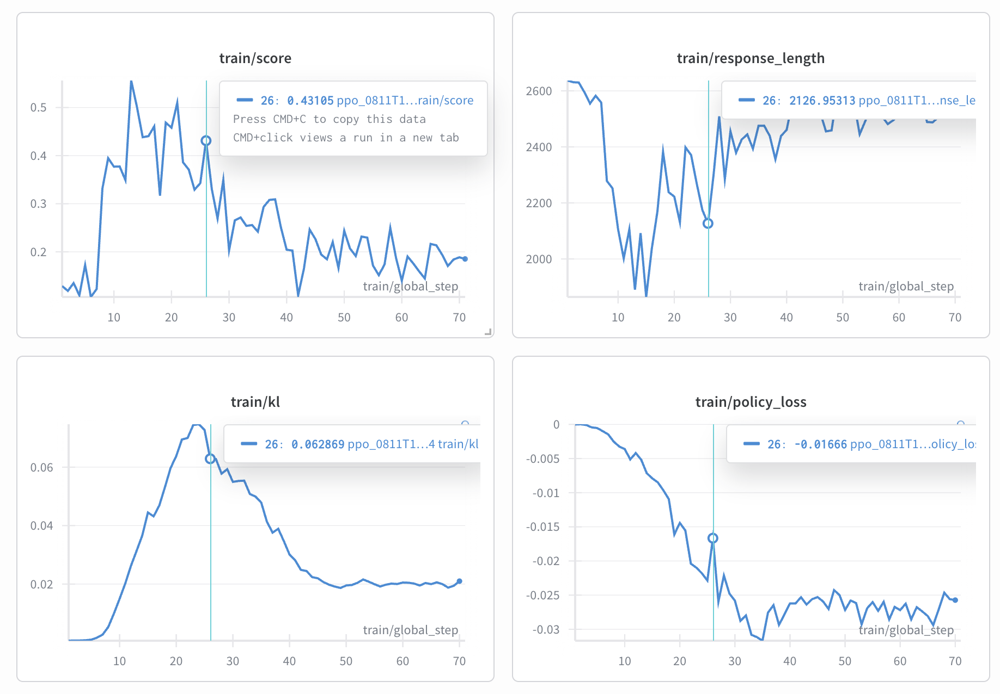

# Experiment 1

- Wandb: https://wandb.ai/firstbatchxyz/obsidian-retrieval-openrlhf/runs/23l5t2yn?nw=nwuseratakant

HF
- Untrained Model: [Qwen/Qwen3-4B-Thinking-2507](https://huggingface.co/Qwen/Qwen3-4B-Thinking-2507)
- Step 13: [driaforall/qwen-4b-thinking-2507-exp1-step13](https://huggingface.co/driaforall/qwen-4b-thinking-2507-exp1-step13)
- Step 21: [driaforall/qwen-4b-thinking-2507-exp1-step21](https://huggingface.co/driaforall/qwen-4b-thinking-2507-exp1-step21)
- Step 26: [driaforall/qwen-4b-thinking-2507-exp1-step26](https://huggingface.co/driaforall/qwen-4b-thinking-2507-exp1-step26)
- Step 38: [driaforall/qwen-4b-thinking-2507-exp1-step38](https://huggingface.co/driaforall/qwen-4b-thinking-2507-exp1-step38)

## Scores (o3 judge)
| Step | Retrieval | Update | Clarification | Overall | Training Score |
|-------|-----------|--------|---------------|---------|-----------|
| 0 | 0.5625 | 0.0000 | 0.3636 | 0.3939 | - |
| 13 | 0.9375 | 0.1250 | 0.4546 | 0.6667 | 0.5562 |
| 21 | 0.9375 | 0.6667 | 0.2727 | 0.6667 | 0.5097 |
| 26 | 0.8125 | 0.1250 | 0.2727 | 0.5455 | 0.4311 |
| 38 | 0.6250 | 0.5000 | 0.2727 | 0.4848 | 0.3092 |

## Plots

### Task Type Metrics and Training Score vs. Overall Eval Score



### Task Type Metrics, Training Score, and Overall Eval Score vs. Step



### Task Type Metrics and Overall Eval Score vs. Training Score



### Training Step 13



### Training Step 21



### Training Step 26



### Training Step 38


# Config

### **config.json**

```json
{
  "model": {
    "name": "Qwen/Qwen3-4B-Thinking-2507"
  },
  "hyperparameters": {
    "init_kl_coef": 0.1,
    "kl_target": 0.02,
    "kl_horizon": 256,
    "max_epochs": 10,
    "actor_learning_rate": "1e-6",
    "critic_learning_rate": "2e-5",
    "num_episodes": 8,
    "thoughts_min_length": 512,
    "advantage_estimator": "group_norm"
  }
} 
```

### **train_agent.sh**

```bash
.venv/bin/python -m openrlhf.cli.train_ppo_ray \
   --ref_num_nodes 1 \
   --ref_num_gpus_per_node 8 \
   --actor_num_nodes 1 \
   --actor_num_gpus_per_node 8 \
   --vllm_num_engines 2 \
   --vllm_tensor_parallel_size 4 \
   --vllm_gpu_memory_utilization 0.30 \
   --colocate_all_models \
   --init_kl_coef $INIT_KL_COEF \
   --kl_target $KL_TARGET \
   --kl_horizon $KL_HORIZON \
   --gamma 0.99 \
   --kl_estimator k3 \
   --pretrain $MODEL_NAME \
   --agent_func_path training/agent_func.py \
   --save_path $SAVE_PATH \
   --ckpt_path $CKPT_PATH \
   --advantage_estimator $ADVANTAGE_ESTIMATOR \
   --save_hf_ckpt \
   --micro_train_batch_size 2 \
   --train_batch_size 32 \
   --micro_rollout_batch_size 2 \
   --rollout_batch_size 32 \
   --n_samples_per_prompt 4 \
   --max_epochs $MAX_EPOCHS \
   --prompt_max_len 4096 \
   --max_samples 100000 \
   --generate_max_len 1024 \
   --zero_stage 3 \
   --bf16 \
   --actor_learning_rate $ACTOR_LR \
   --critic_learning_rate $CRITIC_LR \
   --prompt_data json@data/openrlhf/mixed \
   --input_key context_messages \
   --label_key label \
   --apply_chat_template \
   --use_kl_loss \
   --gradient_checkpointing \
   --packing_samples \
   --vllm_sync_backend nccl \
   --enforce_eager \
   --vllm_enable_sleep \
   --deepspeed_enable_sleep \
   --use_wandb True \
   --num_episodes $NUM_EPISODES \
   --save_steps 1 \
   --packing_samples --flash_attn \
   --wandb_project obsidian-retrieval-openrlhf \
   --eps_clip 0.1 \
   --policy_loss_type gspo \
   --use_liger_kernel \
   --ptx_coef 0.13 
```